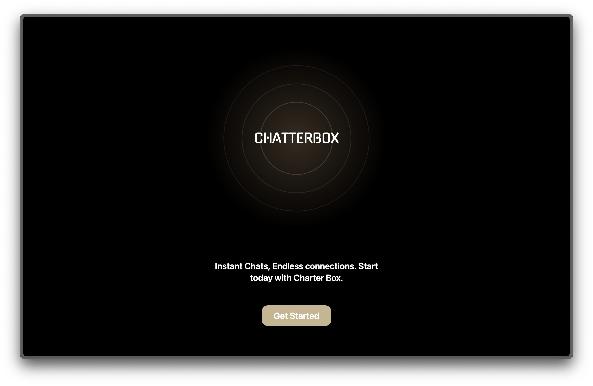
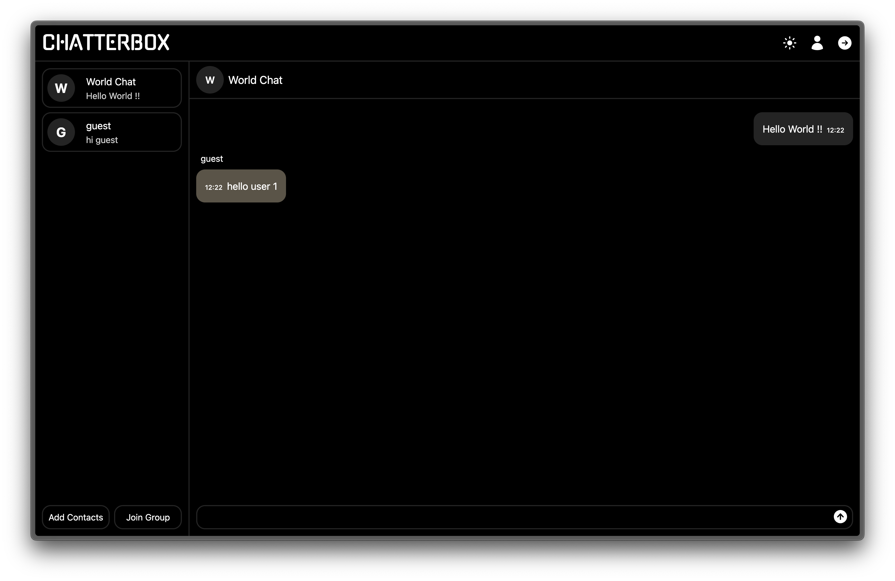
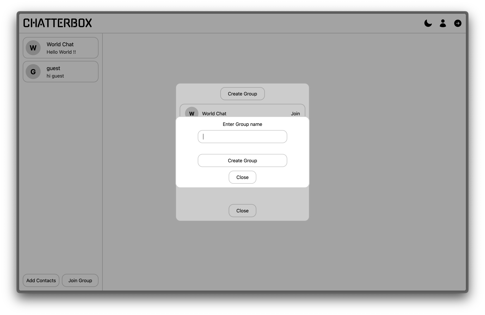

<h3 align="center">ChatterBox</h3>

  

      ChatterBox is a messaging app where you can connect with other users and have group chats. It connects to backend which uses RESTFUL APIs.
     
    <a href="https://chatterbox-henna.vercel.app/">Live Demo</a>
  

 

<!-- ABOUT THE PROJECT -->

### Preview

<h4 align="center">Home Page</h4>
 
 <h4 align="center">Chat Room</h4>
 
<h4 align="center">Create Groups</h4>
 

### API

This app uses Restful APIs to get / post messages,chats and groups. The source code for the API can be found at <a href="https://github.com/notsanta20/chatterbox_api">ChatterBox API</a>

### Built With

<!-- ACKNOWLEDGMENTS -->

## Acknowledgments

- Inspiration by <a href="https://www.theodinproject.com/lessons/nodejs-messaging-app">The Odin Project</a>
